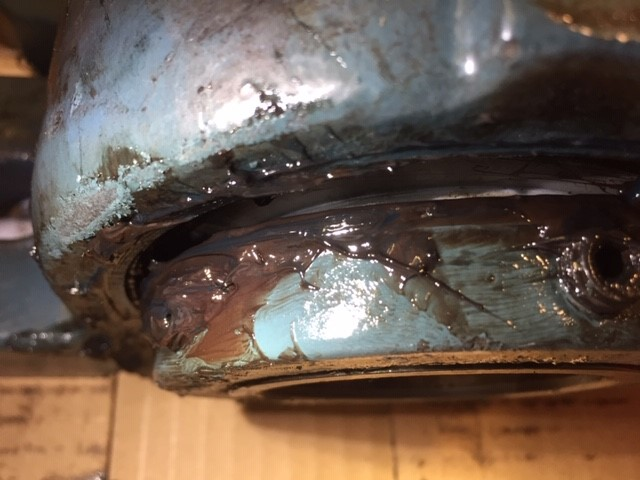

# AHU-5 Fan Bearing Failure in Thrust.

## Bearing appears to have failed due to excessive thrust loads and or contaminated grease i.e., insufficient lubrication. There could also be fitment issues, moisture contamination issues, or alignment issues that are the root cause of the failure. I suggest adding an axial vibration sensor to the Drive End of the fan bearing housing.

### First impressions, the grease looks unusable on the bad bearing.
#### Neville W. Sachs, P.E., 2017. Failure Analysis Made Simple: Bearings and Gears. Ft. Meyers (FL): ReliabilityWeb.com
#### SKF, Bearing Damage and Failure Analysis.

